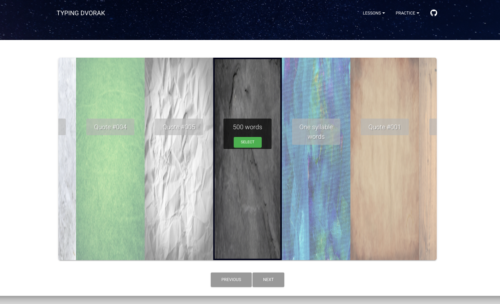
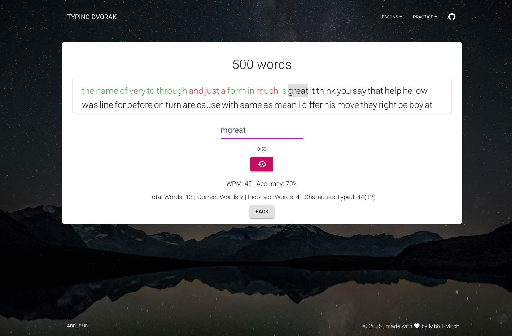

# Programmer Dvorak Typing Game

A web typing tutor focused on the Programmer Dvorak layout. It walks you through structured lessons and free practice sets, measuring speed and accuracy as you go. Built to make adopting the layout faster for developers who want muscle memory without sacrificing symbols and punctuation fluency.

Play at [typingdvorak.com](https://typingdvorak.com/).

## Features
- Dvorak-specific lesson tracks plus practice modes fed by curated JSON configs.
- Real-time metrics: WPM, accuracy, total words/characters, and timer-based or open-ended sessions.
- Level navigation and restart controls tailored for step-by-step progression.
- Material Kit React UI with responsive cards, carousels, and headers.

## Tech Stack
- React 16 + React Router with Material-UI v3 components themed via Sass.
- Express server (`server.js`) serving lesson/practice JSON and the production build on port 5019.
- Axios for API calls, underscore/jquery utilities for the typing engine, and Storybook scripts for component previews.

## Local Development
- Install: `npm install`
- API/content server: `npm run server` (serves `/api` on http://localhost:5019)
- Client: `npm start` (CRA dev server with Sass watcher; proxies `/api` to port 5019)
- Production bundle: `npm run build` then `npm run server` to serve `build/`.

## Architecture / Notes
- `src/index.js` wires React Router using `src/routes/index.jsx` for landing, menu, typing, and profile/login pages.
- `src/views/MenuPage/MenuPage.jsx` calls `/api/load` to list lesson/practice configs from `server/lessons` and `server/practice`, rendering them in a level carousel.
- `src/views/TypingPage/TypingPage.jsx` loads a specific config via `/api/typing/:typingMode/:category/:id` and hands it to `src/components/TypingTest/*` (timers, input, scoring, navigation).
- Styling comes from Material Kit React (`src/assets/scss/material-kit-react.scss`, `src/assets/jss/material-kit-react.jsx`) plus shared UI primitives under `src/components`.
- `server.js` is a small Express layer that reads JSON configs from disk and exposes them to the client while also hosting the built app.

## Roadmap
- Persist session history and progress per lesson.
- Add Programmer Dvorak keyboard overlay/finger guides during tests.
- Broaden practice content (code snippets, punctuation drills) with difficulty filters.
- Improve accessibility (focus management, ARIA labels) and mobile typing ergonomics.
- Add automated tests and Storybook coverage for the TypingTest flow.

## Server Updates (pm2)
- Start locally: `npm run server` (runs `server.js` on port 5019).
- Start under pm2: `pm2 start npm --name typing-dvorak -- run server` then `pm2 save`.
- Enable restart on reboot: `pm2 startup` and run the printed `sudo env PATH=$PATH:/usr/local/bin /usr/lib/node_modules/pm2/bin/pm2 startup systemd -u <user> --hp /home/<user>`.
- Deploy/update flow: pull changes, run `npm install`, `npm run build`, then `pm2 restart typing-dvorak`.

## Screenshots

  
  
<em>Menu page with the lesson carousel and level cards.</em>

  
  
<em>Typing session showing live WPM, accuracy, and timer.</em>

Captured from the current UI: `assets/screenshots/menu.png` and `assets/screenshots/typing-session.png`.
